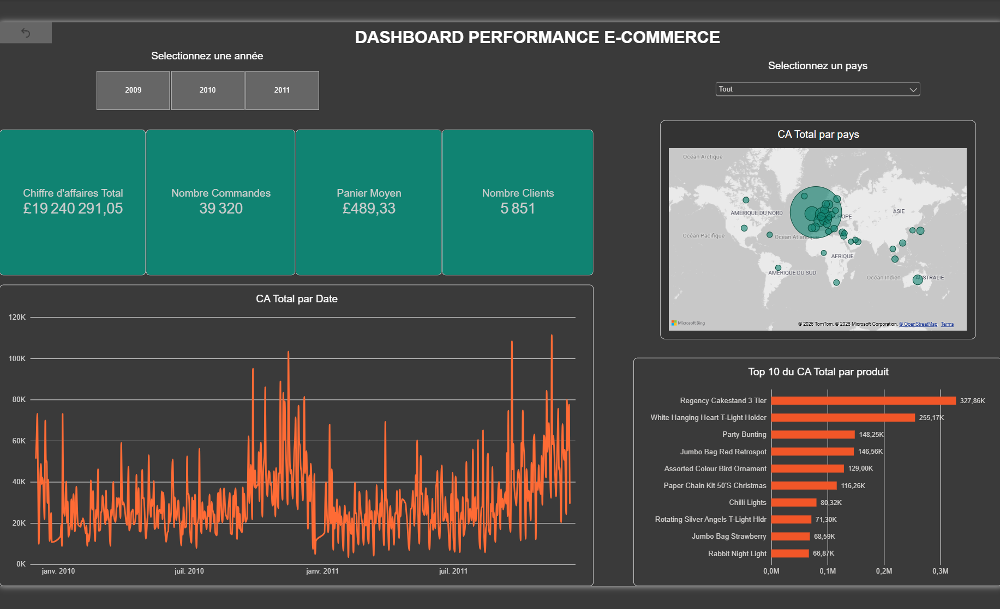

# DASHBOARD PERFORMANCE E-COMMERCE

Dashboard Power BI présentant les KPI clés d'un e-commerce (chiffre d'affaires, commandes, clients, panier moyen) avec filtres dynamiques et suivi de l'évolution temporelle des ventes.


## Contexte

Projet réalisé dans le cadre de la construction d'un portfolio de data analyst freelance. L'objectif : partir d'un jeu de données brut, le nettoyer avec rigueur, puis construire un dashboard interactif exploitable par un décideur métier.

## Source des données

Dataset **Online Retail II** (UCI Machine Learning Repository / Kaggle) : transactions réelles d'un e-commerce basé au Royaume-Uni, décembre 2009 à décembre 2011.

- Lien : https://archive.ics.uci.edu/dataset/502/online+retail+ii
- Licence : CC BY 4.0

## Structure du projet

```
├── data.csv                  # Dataset brut (non versionné, voir .gitignore)
├── explore.py                # Exploration initiale des données (diagnostic)
├── clean.py                  # Script de nettoyage et préparation des données
├── ventes_clean.csv          # Export nettoyé (table de faits) - non versionné
├── dim_date.csv              # Table de dates (dimension) - non versionné
├── dashboard_ventes.pbix     # Fichier Power BI final
├── requirements.txt          # Dépendances Python
└── README.md
```

## Méthodologie

### 1. Exploration (`explore.py`)
Diagnostic du dataset brut : dimensions, types de colonnes, valeurs manquantes, statistiques descriptives. Identification des anomalies à traiter (dates en texte, valeurs négatives, codes non-commerciaux).

### 2. Nettoyage (`clean.py`)
- **Suppression des doublons exacts** : ~34 300 lignes strictement identiques (même facture, produit, quantité, prix et date) détectées et supprimées dès le chargement — un problème repéré en creusant un pic de CA anormal sur le graphique final
- Conversion de `InvoiceDate` en type date, avec vérification de cohérence (plage de dates, distribution mensuelle)
- Distinction entre ventes normales, annulations clients et ajustements internes de stock
- **Exclusion des ventes annulées très rapidement** (moins d'1h après l'achat) : ces commandes, passées puis immédiatement annulées par le client, restaient comptabilisées dans le chiffre d'affaires alors qu'elles n'ont jamais abouti — détection par rapprochement Client + Produit + Quantité entre chaque annulation et sa vente d'origine
- Exclusion des codes non-commerciaux (frais de port, frais bancaires, ajustements manuels...)
- Calcul du chiffre d'affaires par ligne (`LineTotal`)
- Normalisation du texte (casse, espaces) sur `Country` et `Description`
- Typage correct de `Customer ID` (entier nullable → texte)
- Création des colonnes temporelles (`Year`, `Quarter`, `Month`, `YearMonth`, `DateSeule`)
- Génération d'une table de dates complète (`dim_date`), sans trou, pour fiabiliser les filtres et l'intelligence temporelle dans Power BI
- Export au format CSV avec encapsulation complète des valeurs (`QUOTE_ALL`) pour éviter tout décalage de colonnes lié aux virgules dans le texte libre

### 3. Modélisation Power BI
Modèle en étoile : table de faits `ventes_clean` reliée à la dimension `dim_date` (relation plusieurs-à-un sur une colonne de date pure, sans horodatage, pour garantir une correspondance exacte entre les deux tables).

### 4. KPI (mesures DAX)
- Chiffre d'affaires total
- Nombre de commandes (distinct)
- Nombre de clients (distinct)
- Panier moyen

### 5. Visuels
- Cartes KPI
- Graphique d'évolution temporelle avec hiérarchie de drill-down (Année > Trimestre > Mois > Jour)
- Carte du CA par pays
- Top 10 des produits par chiffre d'affaires
- Filtres dynamiques (année, pays)

## Reproduire le projet

```bash
python -m venv venv
venv\Scripts\activate          # Windows
pip install -r requirements.txt
python clean.py
```

Ouvrir ensuite `dashboard_ventes.pbix` dans Power BI Desktop (les sources de données pointeront vers `ventes_clean.csv` et `dim_date.csv` générés par le script).

## Choix méthodologiques notables

- **Chiffre d'affaires vs bénéfice** : le dashboard mesure le CA (ventes brutes), le dataset ne contenant pas d'information sur les coûts.
- **Doublons exacts** : un contrôle de cohérence sur le graphique d'évolution (un pic isolé et disproportionné) a révélé que ~34 300 lignes du fichier source étaient de purs doublons, faussant le CA d'environ 900 K£. Une vérification systématique (`drop_duplicates`) a été ajoutée en amont du nettoyage.
- **Ventes annulées quasi immédiatement** : au-delà des annulations classiques, certaines ventes étaient annulées par le client en quelques minutes seulement. Comme elles n'ont jamais généré de revenu réel, elles sont identifiées par rapprochement (même client, même produit, même quantité, écart de moins d'1h) et exclues du chiffre d'affaires.
- **Annulations classiques conservées séparément** : les commandes annulées par les clients sont identifiées (`IsCancelled`) mais exclues du CA, pour un futur KPI de taux de retour.
- **Ajustements de stock exclus** : les mouvements internes (perte, casse, erreurs d'inventaire) ne sont pas des transactions commerciales et sont retirés de l'analyse.
- **Valeurs manquantes `Customer ID`** : conservées pour le calcul du CA (la vente a eu lieu), mais naturellement exclues des KPI de comptage de clients (`DISTINCTCOUNT` ignore les valeurs vides).

## Outils utilisés

- Python (pandas) — nettoyage et préparation des données
- Power BI Desktop — modélisation, DAX, visualisation
- Git / GitHub — versionnage du code